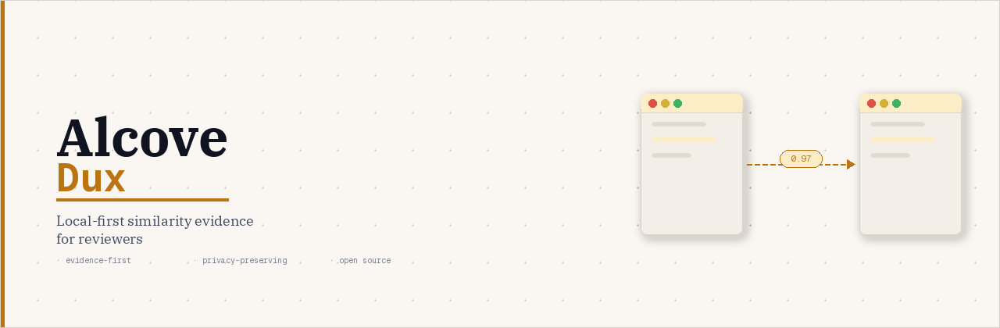

<h1 align="center">Alcove Dux</h1>

  <strong>Private, local-first similarity evidence for educators, editors, and researchers.</strong>

  
  
  
  

Alcove Dux is an open-source, local-first toolkit for educators, editors, researchers, and small institutions that need transparent similarity review without sending private documents to a closed service.

Alcove Dux is a review aid, not a verdict machine. It helps reviewers inspect similarity evidence on their own hardware, and unlike cloud services that retain submitted documents and return a verdict, Alcove Dux runs locally and shows you the evidence.

## ⚡ Start Here

- [Quick Start](docs/quickstart.md): install locally and run a sample scan.
- [Demo Walkthrough](docs/demo.md): run the sample demo and inspect the generated report.
- [CLI Usage](docs/cli.md): command reference for pairwise scans, corpus scans, semantic matching, and calibration.
- [Reports](docs/reports.md): JSON, public HTML, local review HTML, and report privacy behavior.
- [Privacy Boundary](docs/privacy.md): what Alcove Dux does and does not expose.

## 🔎 What It Does

An instructor uploads two documents, runs a scan, and gets a side-by-side highlighted report — locally, without sending text to any server.

- Text, Markdown, PDF, and DOCX ingestion.
- Exact, fuzzy, semantic, and reranked similarity evidence.
- Pairwise scans and local-corpus scans from the CLI.
- Local FastAPI dashboard for document upload, scan creation, and side-by-side review.
- Screen-reader-friendly dashboard and HTML reports with privacy-preserving exports.

## 📚 Documentation

- [Research Notes](docs/research.md) and [Benchmarks](docs/benchmarks.md)
- [Configuration](docs/configuration.md), [Datasets](docs/datasets.md), and [Multilingual Detection](docs/multilingual.md)
- [Vector Stores](docs/vector-stores.md) and [Alcove Plugin Plan](docs/alcove-plugin.md)
- [Deployment Notes](docs/deployment.md), [Hosted Hardening](docs/hosted-hardening.md), and [Repository Setup](docs/repository-setup.md)
- [Roadmap](roadmap.md) and [Demo Video Script](docs/demo-video.md)

## 📦 Package

The package name is `alcove-dux`, the import path is `alcove_dux`, and the CLI command is `alcove-dux`. The core engine can be used as a CLI, Python library, local FastAPI app, or Alcove plugin.

## 🤝 Contributing

Alcove Dux is maintained as a public open-source project. Contributions are encouraged to keep the local-first privacy boundary intact, include tests for behavioral changes, and keep private corpora, generated reports, model caches, and vector indexes out of public commits.

See [CONTRIBUTING.md](CONTRIBUTING.md) for setup, checks, and privacy rules.
